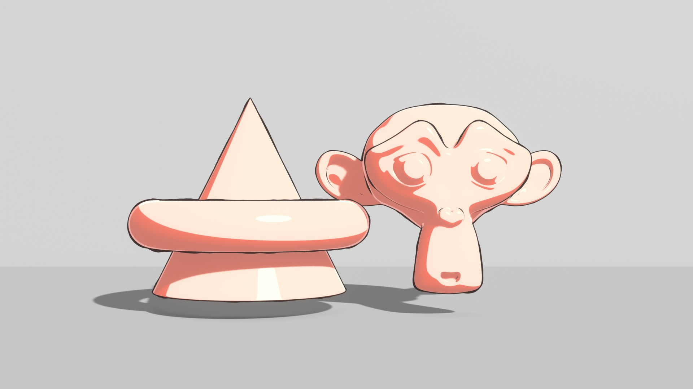
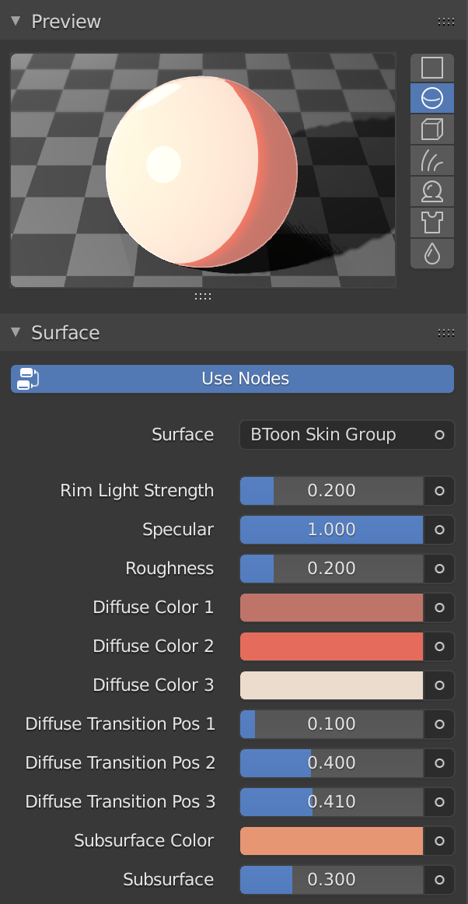
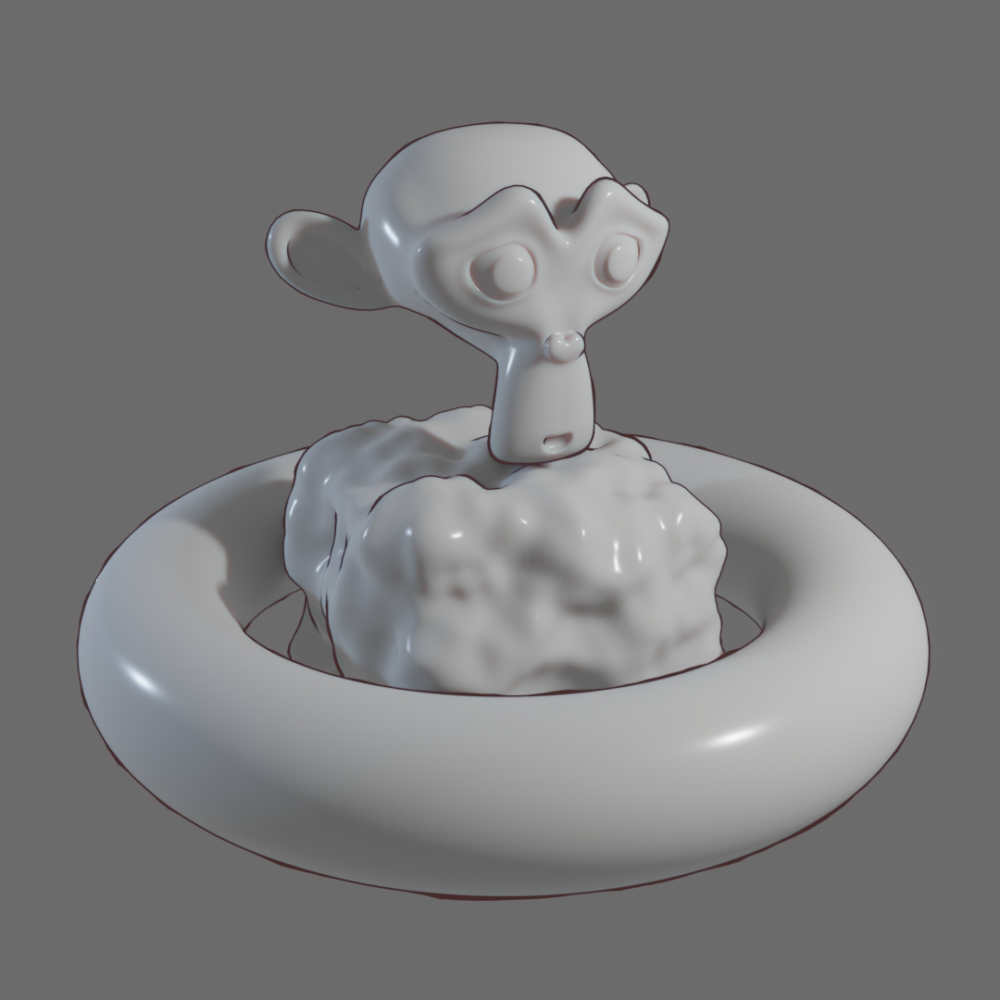

# BToon

Blender addon for toon rendering.

## Toon Shading

### BToon Skin Material

#### Description

This is a simple toon material designed for skins. It has controllable rim lighting, SSS, and specular effects. This material only works with EEVEE.

#### Usage

- Select target objects
- `3D Viewport` > `Object` > `BToon Utilities` > `Append Skin Material`

## Contour Rendering

### Approach 1: Mesh Displacement and Culling

#### Description

This is a mesh-based technique to rendering contours, where meshes are duplicated, flipped, and then displaced outside.

- Pros
  - Thickness can be controlled using textures.
  - Contours can be displaced in the viewport.
  - The same effect can be easily reproduced in other real-time rendering environment such as Unity.
  - ...
- Cons
  - Ridges, valleys, and suggestive contours are not supported.
  - ...

#### Usage

- Select target objects
- `3D Viewport` > `Object` > `BToon Utilities` > `Set Contours`

#### Implementation

- It applies `Solidify` and `Displace` modifiers to the selected objects.
- An emission-based material with backface culling enabled is created and set to contours.

### Future Work

- Utilities for composition-based contour rendering
- Utilities for FreeStyle-based contour rendering

## How to Install

(TODO)

## License

- The Python codes (using Blender Python APIs) are licensed under GPLv3.
- The `.blend` library files are licensed under CC BY 4.0. (However, you do not need the BY credit when using the libraries through this addon.)
